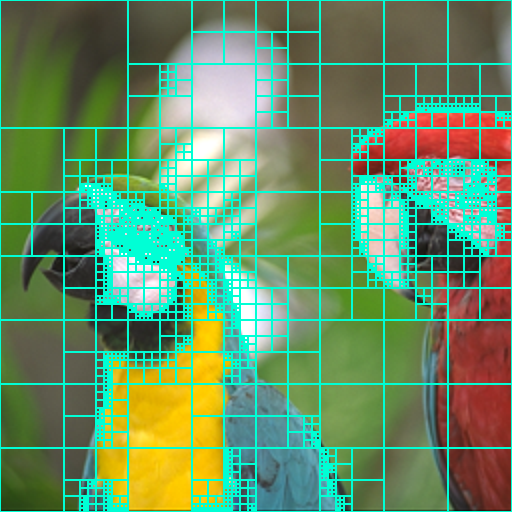

# Laboratorio QuadTree

## Requerimientos e instalación

- Instalar compilador g++ >=9.4.0


```bash
sudo apt install g++
```
## Caracteristicas del Programa

- lectura y escritura de archivos bmp
- Generacion de arbol QuadTree
- Desviación estandar
- impresión

## Demo

Prueba con umbral 30 para la imagen "aves.bmp"
```c++
    QuadTree<Pixel> qt("input.bmp",30);
```



Prueba con umbral 0.1 para la imagen "input.bmp"
```c++
    QuadTree<Pixel> qt("input.bmp",0.1);
```


